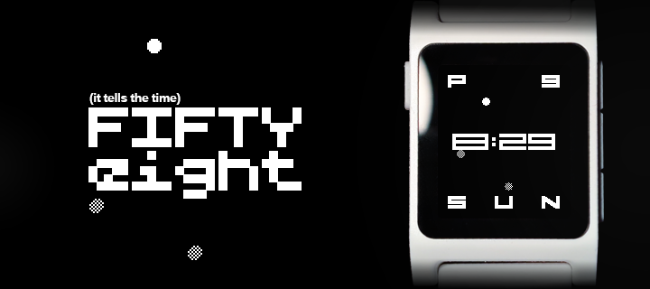

 

  
  
  

 

[Install on Rebble](https://apps.rebble.io/en_US/application/6912d087ad49bb00097251a0)

 

Fiftyeight tells the time. It has won no awards for design, but it does reimagine the WV-58 with dynamic glyphs that change in width to emphasize the hour, has an analog clock constellation that updates each second, and displays the date and weekday in your choice of two or three letters. If you're a 24-hour time weirdo, the watchface will replace the AM/PM indicator with the current month. You can also choose this option for the regular 12-hour clock. Oh, and last but not least: light and dark modes to suit your taste.

Developed with the help of Cline via DeepSeek. Graphics, sprites, design, and architectural decisions by EuphoricPenguin.
