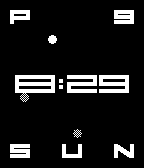
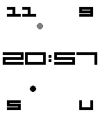

# fiftyeight
A watchface for Pebble.

Fiftyeight tells the time. It has won no awards for design, but it does reimagine the WV-58 with dynamic glyphs
that change in width to emphasize the hour, has an analog clock constellation that updates each second, and displays the day of the month and day of the week in your choice of two or three letters. If you're a 24-hour time weirdo, the watchface will replace the AM/PM indicator with the current month. You can also choose this option for the regular 12-hour clock.

Developed with the help of Cline via DeepSeek.
